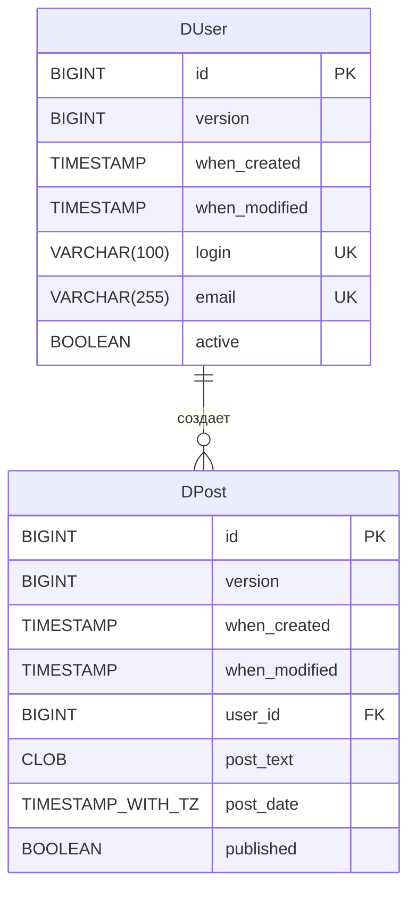
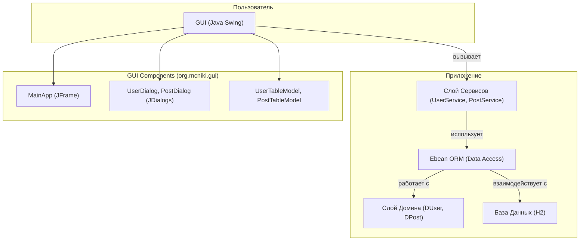

# Ebean CRUD GUI Приложение

Это демонстрационное Java-приложение, использующее Ebean ORM для операций CRUD (Create, Read, Update, Delete) с графическим интерфейсом пользователя (GUI) на Swing. Приложение управляет двумя основными сущностями: Пользователи (`DUser`) и Посты (`DPost`).

## Оглавление

1.  [Основные Возможности](#основные-возможности)
2.  [Технологический Стек](#технологический-стек)
3.  [Требования](#требования)
4.  [Установка и Запуск](#установка-и-запуск)
    *   [Конфигурация Ebean](#конфигурация-ebean)
5.  [Структура Проекта](#структура-проекта)
6.  [Схема Базы Данных](#схема-базы-данных)
    *   [Таблица `d_user`](#таблица-d_user)
    *   [Таблица `d_post`](#таблица-d_post)
    *   [Диаграмма ERD](#диаграмма-erd)
7.  [Работа с Приложением (GUI)](#работа-с-приложением-gui)
    *   [Главное Окно](#главное-окно)
    *   [Управление Пользователями](#управление-пользователями)
    *   [Управление Постами](#управление-постами)
    *   [Диалоговые Окна](#диалоговые-окна)
8.  [Обзор Кода](#обзор-кода)
9.  [Возможные Улучшения](#возможные-улучшения)

## Основные Возможности

*   **Управление Пользователями:**
    *   Создание новых пользователей.
    *   Просмотр списка пользователей.
    *   Редактирование информации существующих пользователей.
    *   Удаление пользователей (с каскадным удалением их постов).
*   **Управление Постами:**
    *   Создание новых постов, связанных с пользователем.
    *   Просмотр всех постов или постов конкретного пользователя.
    *   Редактирование существующих постов.
    *   Удаление постов.
*   **Автоматическое отслеживание:**
    *   Версионирование записей (`@Version`).
    *   Автоматическое проставление времени создания (`@WhenCreated`) и модификации (`@WhenModified`).
*   **Графический интерфейс:**
    *   Интуитивно понятный интерфейс на Java Swing для всех CRUD операций.
    *   Раздельные панели для управления пользователями и постами.
    *   Динамическое обновление таблиц.

## Технологический Стек

*   **Язык:** Java 11+
*   **ORM:** Ebean (с генерацией QueryBean и DDL)
*   **База данных:** H2 (встроенная, in-memory, настраиваемая через `ebean.properties`)
*   **GUI:** Java Swing
*   **Сборка:** Apache Maven
*   **Логирование:** SLF4J (с простой реализацией `slf4j-simple`)
*   **API для персистентности:** Jakarta Persistence API
*   **API для валидации:** Jakarta Validation API

## Требования

*   JDK 11 или выше.
*   Apache Maven 3.6+ (для сборки проекта).

## Установка и Запуск

1.  **Клонируйте репозиторий:**
    ```bash
    git clone <URL_вашего_репозитория>
    cd <имя_папки_проекта>
    ```

2.  **Соберите проект с помощью Maven:**
    Это скомпилирует исходный код, выполнит enhance Ebean сущностей (необходимо для ленивой загрузки, dirty-checking и т.д.) и сгенерирует QueryBeans.
    ```bash
    mvn compile
    ```
    Или для создания jar-файла (не обязательно для запуска из IDE):
    ```bash
    mvn package
    ```

3.  **Запустите приложение:**
    Основной класс для запуска GUI - `org.mcniki.gui.MainApp`.
    *   **Из IDE:** Найдите класс `MainApp.java` и запустите его метод `main()`.
    *   **Из командной строки (если собран jar с зависимостями):** Команда будет зависеть от конфигурации Maven Shade/Assembly Plugin. Для простоты рекомендуется запуск из IDE.

### Конфигурация Ebean

Ebean настраивается через файл `src/main/resources/ebean.properties`.
По умолчанию используется H2 in-memory база данных:
```properties
datasource.db.username=sa
datasource.db.password=
datasource.db.url=jdbc:h2:mem:mcniki_gui_db;DB_CLOSE_DELAY=-1
datasource.db.driver=org.h2.Driver

ebean.ddl.generate=true # Генерировать DDL при запуске
ebean.ddl.run=true      # Выполнять сгенерированный DDL
```
При первом запуске Ebean автоматически создаст таблицы в базе данных согласно DDL, сгенерированному на основе ваших сущностей.

## Структура Проекта

```
.
├── pom.xml                     # Файл конфигурации Maven
└── src
    ├── main
    │   ├── java
    │   │   └── org
    │   │       └── mcniki
    │   │           ├── domain        # Ebean сущности (DUser, DPost, BaseModel)
    │   │           │   └── query     # Сгенерированные Ebean QueryBeans (QDUser, QDPost)
    │   │           ├── gui           # Классы GUI (MainApp, UserDialog, PostDialog, *TableModel)
    │   │           ├── service       # Сервисные классы (UserService, PostService)
    │   │           └── Main.java     # Консольный пример использования (не для GUI)
    │   └── resources
    │       ├── ebean.properties    # Конфигурация Ebean
    │       └── logback.xml OR simplelogger.properties # (Опционально) Конфигурация логирования
    └── test
        └── java                    # Юнит-тесты (не включены в пример)
```

## Схема Базы Данных

База данных состоит из двух основных таблиц: `d_user` и `d_post`. Обе наследуют общие поля из `BaseModel`.

### Общие поля (из `BaseModel`)

Эти поля присутствуют в обеих таблицах `d_user` и `d_post`:

*   `id` (BIGINT, Primary Key): Уникальный идентификатор записи.
*   `version` (BIGINT): Версия записи для оптимистической блокировки.
*   `when_created` (TIMESTAMP): Дата и время создания записи.
*   `when_modified` (TIMESTAMP): Дата и время последнего изменения записи.

### Таблица `d_user`

Хранит информацию о пользователях.

| Поле           | Тип                  | Ограничения                      | Описание                                   |
| -------------- | -------------------- | -------------------------------- | ------------------------------------------ |
| `id`           | BIGINT               | PK, NOT NULL                     | Уникальный идентификатор пользователя      |
| `version`      | BIGINT               | NOT NULL                         | Версия записи                              |
| `when_created` | TIMESTAMP            | NOT NULL                         | Время создания                             |
| `when_modified`| TIMESTAMP            | NOT NULL                         | Время последнего изменения                |
| `login`        | VARCHAR(100)         | UNIQUE, NOT NULL                 | Логин пользователя                         |
| `email`        | VARCHAR(255)         | UNIQUE, NOT NULL                 | Email пользователя                         |
| `active`       | BOOLEAN              | NOT NULL, DEFAULT TRUE           | Флаг активности пользователя               |

### Таблица `d_post`

Хранит информацию о постах, опубликованных пользователями.

| Поле           | Тип                  | Ограничения                      | Описание                                   |
| -------------- | -------------------- | -------------------------------- | ------------------------------------------ |
| `id`           | BIGINT               | PK, NOT NULL                     | Уникальный идентификатор поста            |
| `version`      | BIGINT               | NOT NULL                         | Версия записи                              |
| `when_created` | TIMESTAMP            | NOT NULL                         | Время создания                             |
| `when_modified`| TIMESTAMP            | NOT NULL                         | Время последнего изменения                |
| `user_id`      | BIGINT               | FK (d_user.id), NOT NULL         | ID пользователя, создавшего пост           |
| `post_text`    | CLOB/TEXT            | NOT NULL                         | Текст поста                                |
| `post_date`    | TIMESTAMP WITH TZ    | NOT NULL                         | Дата и время публикации поста (с таймзоной)|
| `published`    | BOOLEAN              | NOT NULL, DEFAULT FALSE          | Флаг, опубликован ли пост                  |

### Диаграмма ERD


*   `PK`: Primary Key (Первичный ключ)
*   `FK`: Foreign Key (Внешний ключ)
*   `UK`: Unique Key (Уникальный ключ)
*   `||--o{`: Отношение "один ко многим" (один пользователь может иметь много постов)

## Работа с Приложением (GUI)

При запуске `org.mcniki.gui.MainApp` открывается главное окно приложения. Если база данных пуста, приложение автоматически добавит несколько тестовых пользователей и постов.

### Главное Окно

Главное окно разделено на две основные части с помощью `JSplitPane`:
1.  **Панель "Users" (Пользователи):** Расположена сверху.
2.  **Панель "Posts" (Посты):** Расположена снизу.

#### Панель "Users"

*   **Таблица пользователей:** Отображает список всех пользователей с полями: ID, Login, Email, Active.
*   **Кнопки управления пользователями:**
    *   `Add User`: Открывает диалоговое окно для добавления нового пользователя.
    *   `Edit User`: (Активна, если выбран пользователь) Открывает диалоговое окно для редактирования выбранного пользователя.
    *   `Delete User`: (Активна, если выбран пользователь) Запрашивает подтверждение и удаляет выбранного пользователя вместе со всеми его постами (каскадное удаление).
    *   `Add Post for User`: (Активна, если выбран пользователь) Открывает диалоговое окно для добавления нового поста от имени выбранного пользователя.
    *   `Refresh Users`: Обновляет список пользователей из базы данных.

Выбор пользователя в таблице пользователей автоматически фильтрует список постов в панели "Posts", отображая только посты этого пользователя. Также активируются/деактивируются соответствующие кнопки.

#### Панель "Posts"

*   **Таблица постов:** Отображает список постов. По умолчанию пуста или показывает посты выбранного пользователя. Поля: ID, User (логин), Post Text (превью), Post Date, Published.
*   **Кнопки управления постами:**
    *   `Add Any Post`: Открывает диалоговое окно для добавления нового поста. В этом диалоге можно будет выбрать пользователя из выпадающего списка.
    *   `Edit Post`: (Активна, если выбран пост) Открывает диалоговое окно для редактирования выбранного поста.
    *   `Delete Post`: (Активна, если выбран пост) Запрашивает подтверждение и удаляет выбранный пост.
    *   `Show All Posts`: Загружает и отображает все посты всех пользователей в таблице постов.

Выбор поста в таблице постов активирует/деактивирует кнопки `Edit Post` и `Delete Post`.

### Диалоговые Окна

1.  **UserDialog (`Add User` / `Edit User`)**
    *   `Login`: Текстовое поле для логина пользователя.
    *   `Email`: Текстовое поле для email пользователя.
    *   `Active`: Флажок (checkbox) для установки статуса активности пользователя.
    *   Кнопки `Save` и `Cancel`.

2.  **PostDialog (`Add Post` / `Edit Post`)**
    *   `User`: Выпадающий список для выбора пользователя (автора поста). При редактировании или добавлении поста для конкретного пользователя это поле может быть предзаполнено и неактивно.
    *   `Post Text`: Многострочное текстовое поле для ввода содержимого поста.
    *   `Post Date (ISO)`: Текстовое поле для даты поста. Ожидается формат ISO OffsetDateTime (например, `2023-10-27T15:30:00+03:00` или `2023-10-27T12:30:00Z`). По умолчанию заполняется текущей датой и временем.
    *   `Published`: Флажок для установки статуса публикации поста.
    *   Кнопки `Save` и `Cancel`.

При сохранении данных в диалоговых окнах соответствующие таблицы в главном окне обновляются.

## Обзор Кода

*   **`org.mcniki.domain`**: Содержит JPA/Ebean сущности (`DUser`, `DPost`) и базовый класс `BaseModel`.
    *   `BaseModel`: Абстрактный класс с общими полями (`id`, `version`, `whenCreated`, `whenModified`).
    *   `DUser`: Сущность пользователя со связью "один-ко-многим" к `DPost`.
    *   `DPost`: Сущность поста со связью "многие-к-одному" к `DUser`.
*   **`org.mcniki.domain.query`**: Содержит сгенерированные Ebean QueryBeans (`QDUser`, `QDPost`), которые предоставляют типобезопасный API для построения запросов.
*   **`org.mcniki.service`**: Содержит сервисные классы (`UserService`, `PostService`), инкапсулирующие логику взаимодействия с базой данных через Ebean.
*   **`org.mcniki.gui`**: Содержит классы, отвечающие за графический интерфейс пользователя.
    *   `MainApp`: Главный класс приложения, создающий основное окно JFrame.
    *   `UserDialog`, `PostDialog`: Классы для диалоговых окон добавления/редактирования.
    *   `UserTableModel`, `PostTableModel`: Модели таблиц для `JTable`, адаптирующие списки сущностей для отображения.
*   **`src/main/resources/ebean.properties`**: Файл конфигурации Ebean (подключение к БД, DDL генерация и т.д.).

## Возможные Улучшения

*   **Валидация ввода:** Добавить более строгую валидацию полей в диалоговых окнах (например, формат email, длина текста).
*   **Компонент выбора даты:** Заменить текстовое поле для даты на более удобный компонент (календарь).
*   **Поиск/Фильтрация:** Добавить возможность поиска пользователей и постов по различным критериям.
*   **Пагинация:** Для больших объемов данных реализовать пагинацию в таблицах.
*   **Асинхронные операции:** Выполнять длительные операции с БД (загрузка, сохранение) в фоновом потоке, чтобы не блокировать GUI.
*   **Улучшенное управление ошибками:** Более детальные сообщения об ошибках для пользователя.
*   **Локализация:** Поддержка нескольких языков интерфейса.
*   **Тестирование:** Написание юнит-тестов для сервисного слоя и интеграционных тестов.
*   **Улучшенный дизайн:** Использование более современных Look and Feel или кастомных компонентов для улучшения внешнего вида.


Хорошо, давайте подробно разберем архитектуру вашего приложения.

Приложение построено на основе классической **многоуровневой (или многослойной) архитектуры**, что является распространенным подходом для разделения ответственностей и повышения модульности, тестируемости и сопровождаемости кода.

Основные слои в вашем приложении:

1.  **Слой Представления (Presentation Layer) - GUI (`org.mcniki.gui`)**
2.  **Слой Сервисов (Service Layer) - Бизнес-логика (`org.mcniki.service`)**
3.  **Слой Доступа к Данным (Data Access Layer) - Ebean ORM**
4.  **Слой Домена (Domain Layer) - Модель данных (`org.mcniki.domain`)**
5.  **База Данных (Database) - H2 (в данном случае)**

Давайте рассмотрим каждый слой подробнее:

---

### 1. Слой Домена (Domain Layer) - `org.mcniki.domain`

*   **Назначение:** Этот слой определяет структуру данных приложения. Он содержит POJO (Plain Old Java Objects) классы, которые представляют сущности вашей предметной области (пользователи, посты). Эти классы аннотированы для работы с Ebean ORM, указывая, как они должны быть отображены на таблицы базы данных.
*   **Ключевые компоненты:**
    *   `BaseModel.java`: Абстрактный класс, предоставляющий общие поля для всех сущностей (ID, версия, временные метки создания/изменения). Использует аннотации Ebean `@Id`, `@Version`, `@WhenCreated`, `@WhenModified` и JPA `@MappedSuperclass`.
    *   `DUser.java`: Сущность, представляющая пользователя. Содержит поля, такие как `login`, `email`, `active`, и связь "один-ко-многим" с `DPost` (`@OneToMany`). Аннотирована `@Entity`, `@Table`.
    *   `DPost.java`: Сущность, представляющая пост. Содержит поля, такие как `postText`, `postDate`, `published`, и связь "многие-к-одному" с `DUser` (`@ManyToOne`). Аннотирована `@Entity`, `@Table`.
    *   `org.mcniki.domain.query`: Этот пакет содержит **QueryBeans** (`QDUser`, `QDPost`), автоматически сгенерированные Ebean. Они предоставляют типобезопасный API для построения SQL-подобных запросов к базе данных, что уменьшает вероятность ошибок во время выполнения и улучшает читаемость кода запросов.
*   **Ответственность:**
    *   Определение структуры данных и их взаимосвязей.
    *   Содержание аннотаций для ORM-маппинга и валидации (например, `@NotNull`, `@Size`).

---

### 2. Слой Доступа к Данным (Data Access Layer) - Ebean ORM

*   **Назначение:** Этот слой отвечает за все взаимодействия с базой данных. В вашем приложении эту роль выполняет **Ebean ORM**. Ebean абстрагирует низкоуровневую работу с JDBC и SQL, позволяя вам работать с объектами домена напрямую.
*   **Ключевые компоненты:**
    *   **Ebean `Database` instance:** Центральный объект Ebean, через который выполняются все операции с БД (save, find, update, delete). Получается через `DB.getDefault()`.
    *   **Конфигурация:** `ebean.properties` файл, который определяет параметры подключения к БД, настройки DDL-генерации, пакеты для сканирования сущностей и др.
    *   **DDL генерация:** Ebean может автоматически генерировать и выполнять DDL (Data Definition Language) скрипты для создания/обновления схемы БД на основе ваших доменных сущностей.
    *   **Транзакции:** Ebean управляет транзакциями. Для простых операций (один вызов `save()`, `delete()`, `update()`) транзакции часто неявные. Для более сложных операций можно управлять транзакциями явно.
*   **Ответственность:**
    *   Преобразование вызовов методов (например, `database.save(user)`) в SQL-запросы.
    *   Преобразование результатов SQL-запросов (строк из таблиц) обратно в объекты домена.
    *   Управление подключениями к базе данных.
    *   Управление транзакциями.
    *   Обеспечение персистентности (сохранения) объектов домена.

---

### 3. Слой Сервисов (Service Layer) - `org.mcniki.service`

*   **Назначение:** Этот слой содержит бизнес-логику приложения. Он выступает в качестве посредника между слоем представления (GUI) и слоем доступа к данным (Ebean). Он инкапсулирует логику выполнения операций, которые могут включать несколько шагов или взаимодействие с несколькими сущностями.
*   **Ключевые компоненты:**
    *   `UserService.java`: Предоставляет операции для управления пользователями (сохранить, найти, удалить, обновить, получить список).
    *   `PostService.java`: Предоставляет операции для управления постами.
*   **Ответственность:**
    *   Оркестрация CRUD-операций для сущностей.
    *   Реализация специфической бизнес-логики (хотя в данном CRUD-приложении она минимальна, в более сложных системах здесь могут быть проверки прав, сложные вычисления, взаимодействие с внешними системами и т.д.).
    *   Использование Ebean `Database` и QueryBeans для взаимодействия со слоем доступа к данным.
    *   Декаплинг слоя представления от деталей реализации персистентности. GUI не знает, как данные сохраняются, он просто вызывает методы сервиса.

---

### 4. Слой Представления (Presentation Layer) - `org.mcniki.gui`

*   **Назначение:** Этот слой отвечает за взаимодействие с пользователем. Он отображает данные и принимает пользовательский ввод. В вашем случае это графический интерфейс, построенный на Java Swing.
*   **Ключевые компоненты:**
    *   `MainApp.java`: Главное окно приложения (`JFrame`). Содержит таблицы для отображения пользователей и постов, кнопки для выполнения действий.
    *   `UserDialog.java`, `PostDialog.java`: Диалоговые окна (`JDialog`) для создания и редактирования пользователей и постов соответственно.
    *   `UserTableModel.java`, `PostTableModel.java`: Реализации `AbstractTableModel`, которые служат адаптерами между списком объектов домена (`List<DUser>`, `List<DPost>`) и `JTable` для их отображения.
    *   Стандартные компоненты Swing: `JTable`, `JButton`, `JTextField`, `JCheckBox`, `JComboBox`, `JScrollPane` и др.
    *   Обработчики событий (Listeners): `ActionListener` для кнопок, `ListSelectionListener` для таблиц, которые реагируют на действия пользователя.
*   **Ответственность:**
    *   Отображение данных, полученных от сервисного слоя.
    *   Сбор данных, введенных пользователем.
    *   Передача команд пользователя (например, "сохранить пользователя") сервисному слою для обработки.
    *   Базовая валидация ввода на стороне клиента (хотя основная валидация может быть и на уровне домена/сервиса).
    *   Управление состоянием GUI (активация/деактивация кнопок, обновление таблиц).

---

### 5. База Данных (Database)

*   **Назначение:** Физическое хранилище данных. В данном проекте по умолчанию используется H2 (встроенная, работающая в памяти), но благодаря Ebean, ее можно легко заменить на другую реляционную СУБД (PostgreSQL, MySQL, Oracle и т.д.), изменив конфигурацию в `ebean.properties`.
*   **Ответственность:**
    *   Надежное хранение данных.
    *   Обеспечение целостности данных (через ограничения, ключи).
    *   Выполнение SQL-запросов, полученных от ORM.

---

### Диаграмма Архитектуры (Упрощенная)



### Потоки Взаимодействия (Пример: Добавление нового пользователя)

1.  **Пользователь (GUI):** Пользователь нажимает кнопку "Add User" в `MainApp`.
2.  **GUI (`MainApp`):** Создает и отображает экземпляр `UserDialog`.
3.  **Пользователь (GUI):** Вводит данные в `UserDialog` и нажимает "Save".
4.  **GUI (`UserDialog`):**
    *   Собирает введенные данные.
    *   Создает новый объект `DUser`.
    *   Вызывает метод `saveUser(newUser)` у экземпляра `UserService`.
5.  **Сервисный Слой (`UserService`):**
    *   Получает объект `DUser`.
    *   Может выполнить дополнительную бизнес-логику или валидацию (в данном примере минимально).
    *   Вызывает `database.save(newUser)` (метод Ebean ORM).
6.  **Слой Доступа к Данным (Ebean ORM):**
    *   Преобразует объект `DUser` в SQL INSERT-запрос.
    *   Открывает транзакцию (если еще не открыта).
    *   Выполняет SQL-запрос к **Базе Данных (H2)**.
    *   Коммитит транзакцию.
    *   Присваивает сгенерированный ID и обновляет поля `@Version`, `@WhenCreated` в объекте `DUser`.
7.  **Сервисный Слой (`UserService`):** Метод `saveUser` завершается.
8.  **GUI (`UserDialog`):** Закрывается.
9.  **GUI (`MainApp`):** Вызывает `userService.findAllUsers()` для обновления списка пользователей.
10. **Сервисный Слой (`UserService`):** Вызывает `new QDUser(database).findList()` (используя QueryBean).
11. **Слой Доступа к Данным (Ebean ORM):**
    *   Генерирует SQL SELECT-запрос.
    *   Выполняет запрос к **Базе Данных (H2)**.
    *   Преобразует полученные строки из БД в список объектов `DUser`.
12. **Сервисный Слой (`UserService`):** Возвращает список `DUser` в `MainApp`.
13. **GUI (`MainApp`):** Обновляет `UserTableModel` новым списком, что приводит к перерисовке `JTable`.

### Преимущества такой архитектуры:

*   **Разделение ответственностей (Separation of Concerns):** Каждый слой имеет четко определенную роль.
*   **Модульность:** Компоненты внутри слоя и сами слои относительно независимы.
*   **Тестируемость:** Можно тестировать слои изолированно (например, сервисы без GUI, используя mock-объекты для Ebean или тестовую БД).
*   **Сопровождаемость:** Изменения в одном слое (например, замена СУБД или обновление GUI-библиотеки) оказывают минимальное влияние на другие слои.
*   **Повторное использование:** Сервисный слой и слой домена могут быть повторно использованы, если вы решите создать другой интерфейс (например, веб-приложение или REST API).


